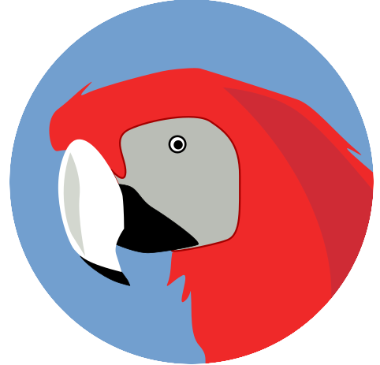

Yarrosco
============

*Yarr!*
-------

Yarrosco is a pirate parrot that likes repeating your chats. He will read from Twitch, Matrix and other sources, in such a way that you can easily put it as an overlay in OBS inside your stream.

The name is an acronym for:

*Yet Another Rust Rewrite of an On-Screen Chat Overlay.*

Current state
--------------

This software is under heavy development and it's difficult to get running.
Functionality is very limited: it only covers strictly one use case.

Only works if it is connected to Matrix and Twitch. Both are
mandatory, and only one account and room for each. Anything more or less, it is
not currently supported.

Outputs to OBS via Browser. OBS Browser plugin is not tested with Yarrosco.
The only tested method is having a local web server running, run Firefox ESR to
the page, and capture the window within OBS.

Binary releases
---------------

Installing from binary is not supported and we don't provide builds. Yarrosco
must be built from sources in order to work for your computer.

Compiling and setting up Yarrosco
----------------------------------

For building Yarrosco you'll need a working Rust (stable) toolchain and 
optionally a Typescript compiler. We provide in our repository the Typescript
files compiled to Javascript, so as long as you don't plan to change the JS code
you don't need a Typescript compiler.

Refer to [README_setup.md](./README_setup.md) for the complete instructions.

License
--------

Licensed under Apache License v2.

> **NOTE:** Only the files present in this folder are licensed under Apache License v2.
  The dependencies of the different programs have their own licenses. 
  The resulting binaries may or may not be licensable as Apache License v2.

